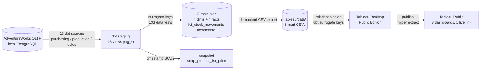

# operations-analytics-dbt-tableau-project

> Local-stack analytics engineering — AdventureWorks distribution slice → PostgreSQL →
> dbt (tested 8-table star: custom generic tests, dbt-utils + dbt-expectations, reusable
> macro, incremental model, snapshot) → live three-dashboard Tableau Public workbook.
> Mini-project #1 of Phil's data engineering portfolio.

**Status: COMPLETE — 2026-06-10.** End-to-end and interview-ready: PostgreSQL source →
dbt warehouse (full `dbt build` = **155 PASS / 0 ERROR**) → CSV mart export →
**[live Tableau Public workbook](https://public.tableau.com/views/adventureworks_operations/OutboundSalesCustomer?:display_count=n&:origin=viz_share_link)**
(three dashboards, one link). Full build history, design decisions and the phase plan
live in `PROJECT_CONTEXT.md` and `PROJECT_PLAN.md`.

## What this project demonstrates

- **dbt testing depth** — custom generic tests authored from scratch (`not_negative`,
  `at_or_below_column`) plus dbt-utils + dbt-expectations package tests; 133 data tests
- **Reusable macro** (`extended_amount`) centralising the line-amount rule across two facts
- **Incremental model** — append-only stock-movement ledger, delete+insert strategy,
  idempotent re-runs, plus a verified UNION of the AdventureWorks archive table
- **Snapshot (SCD2)** over dated list-price changes (timestamp strategy, YAML form)
- **Dimensional modelling** — 8-table star with hashed surrogate keys and
  referential-integrity tests fact → dim
- **BI under platform constraints** — Tableau Public has no database connector, so the
  marts ship via an idempotent CSV export and the star is rebuilt in Tableau's data model
- **Three-dashboard operations suite** following the distribution flow
  (inbound → warehouse → outbound) on one published link

## Architecture



## Stack

| Layer | Choice |
| --- | --- |
| Warehouse | PostgreSQL 18 (local) |
| Transformation | dbt-core 1.11.8 + dbt-postgres 1.10.0 (pinned) |
| Test packages | dbt-labs/dbt_utils 1.3.3 · metaplane/dbt_expectations 0.10.10 |
| Modelling | Kimball star (4 dims / 4 facts), single analytics schema |
| BI | Tableau Desktop Public Edition → Tableau Public |
| BI handoff | psql \copy mart exports → CSV → Tableau relationships on dbt surrogate keys |
| Source data | AdventureWorks OLTP (PostgreSQL port, morenoh149/postgresDBSamples) |

## Project structure

```
operations-analytics-dbt-tableau-project/
├─ adventureworks_ops/          # dbt project
│  ├─ models/
│  │  ├─ staging/               # 13 stg_* views + sources YAML (chain tests)
│  │  └─ marts/                 # 8-table star: dim_* / fct_* + tests YAML
│  ├─ macros/                   # extended_amount (reusable line-amount rule)
│  ├─ tests/generic/            # not_negative, at_or_below_column (from scratch)
│  ├─ snapshots/                # snap_product_list_price (SCD2, YAML form)
│  └─ packages.yml              # pinned dbt_utils + dbt_expectations + dbt_date
├─ sql/
│  ├─ verify/                   # source-load row-count parity checks
│  └─ export/                   # marts → CSV export (psql \copy, idempotent)
├─ tableau/
│  ├─ adventureworks_operations.twbx   # canonical workbook (published)
│  ├─ data/                     # 8 mart CSVs (Tableau Public has no DB connector)
│  └─ screenshots/              # one per dashboard (embedded below)
├─ requirements.txt             # pinned dbt stack
└─ *.md                         # PROJECT_PLAN, PROJECT_CONTEXT, PREFLIGHT_AUDIT,
                                # DBT_PIPELINE walkthrough, ENGINEERING_STANDARDS
```

## How this project was built

This project was built using AI-assisted pair programming (Claude by Anthropic).
All architecture decisions, technology selections, and final design choices are my
own; the AI accelerated implementation and acted as a senior-DE code reviewer. The
intent of the project is portfolio learning — every component was built with explicit
understanding of what it does and why. The layer-by-layer walkthrough lives in
`DBT_PIPELINE.md`; decision records and the full build history are in
`PROJECT_CONTEXT.md` and `PROJECT_PLAN.md`.

## Project documents

- `DBT_PIPELINE.md` — layer-by-layer pipeline walkthrough (start here for the dbt depth)
- `PROJECT_PLAN.md` — locked scope, phase plan, design decisions
- `PROJECT_CONTEXT.md` — running session state + full build history
- `PREFLIGHT_AUDIT.md` — dataset pre-flight + GO/NO-GO rationale
- `ENGINEERING_STANDARDS.md` — 10-criteria per-script audit + phase-boundary checks

## Dashboards

Three interactive dashboards in one workbook, published once:
**[AdventureWorks Operations on Tableau Public](https://public.tableau.com/views/adventureworks_operations/OutboundSalesCustomer?:display_count=n&:origin=viz_share_link)**.
Viewer download is enabled by design. If the viz appears blank, allowlist
`public.tableau.com` in your ad-blocker.

### Outbound: Sales & Customer


Five KPI tiles (Net Sales $109.8M, Units, Orders, AOV, Customers), monthly net-sales
trend 2011–2014, top products, sales by product line and by customer type. Year filter
drives every viz on the page.

### Inbound: Supplier & Purchasing


The buy-side twin: PO Spend $63.8M KPI strip, monthly PO spend, top-10 vendors by
spend, purchase volume by product line, and a spend-concentration split (top 10
vendors = 43% of spend).

### Warehouse: Inventory & Stock Movement


Deliberately differentiated layout: left KPI rail (stock on hand, SKUs, zones, items
below reorder), stock movements by type 2011–2014 (the live AdventureWorks ledger
unioned with its archive table), reorder alerts with per-item reorder-point reference
lines, and an inventory-by-zone treemap. Location filter on the inventory vizzes.

## Related projects

Part of a data-engineering portfolio: three main projects + three mini-projects.

- **Mini #1 — Operations Analytics** *(this one)* — dbt testing + macros depth on
  PostgreSQL → live Tableau Public three-dashboard workbook.
- **Project #1 — CDC NT Transport Analytics** — dbt-first pipeline on PostgreSQL →
  Power BI; Kimball modelling foundation.
- **Project #2 — Retail Demand & Forecasting** — cloud warehouse + orchestration:
  Azure SQL → Snowflake → Airflow (Docker) → dbt → Power BI, with a Cortex forecast layer.
- **Project #3 — S&P 100 Financial Analytics Lakehouse** — AWS-native lakehouse:
  S3 + Glue + Athena + Iceberg, dbt-athena, Step Functions, 6-page Power BI, keyless OIDC CI/CD.

## Author

Phil McKechnie — Business Intelligence Analyst & Developer, Melbourne. 15+ years
across operations, supply chain and analytics; the last 5 in dedicated BI roles
(SQL, Tableau, Power BI). Building a data-engineering portfolio across dbt, cloud
warehouses and AWS-native lakehouse work.
