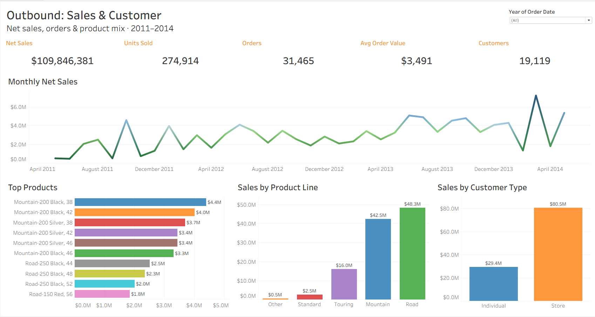
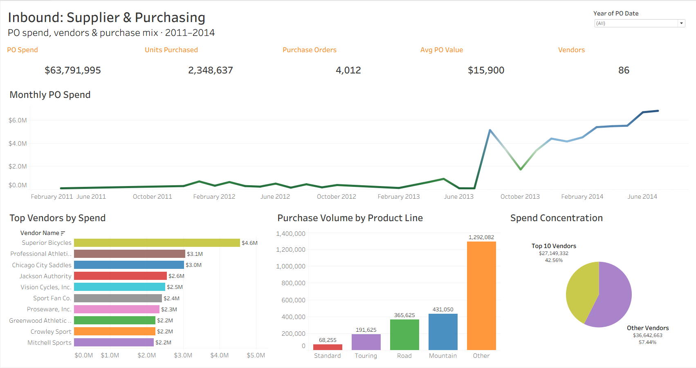
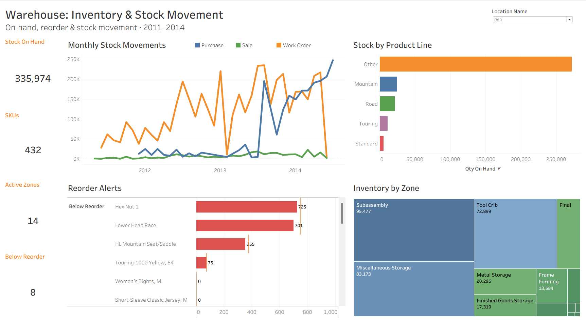

# Operations Analytics — dbt depth → Tableau (Warehouse & Distribution)

Mini-project showcasing **dbt testing + macros depth** on a wholesale warehouse &
distribution dataset, modelled in **local PostgreSQL** with **dbt-postgres** and
visualised in **Tableau Public**.

> **Status:** Phase 4 complete — the workbook is live on Tableau Public (link below).
> Full `dbt build` = **155 PASS / 0 ERROR**: 12 staging views + an 8-table star with
> hashed surrogate keys, custom generic tests, dbt-utils + dbt-expectations packages,
> a reusable macro, an incremental stock-movements model and a price-history snapshot.
> Phase 5 (walkthrough doc + screen recording) is next.

## Live dashboards (Tableau Public)

**[AdventureWorks Operations — one workbook, three dashboard tabs](https://public.tableau.com/views/adventureworks_operations/OutboundSalesCustomer?:display_count=n&:origin=viz_share_link)**

Three dashboards follow the distribution flow — **Outbound: Sales & Customer**,
**Inbound: Supplier & Purchasing**, **Warehouse: Inventory & Stock Movement**.
Tableau Public has no database connector, so the 8 dbt marts are exported to CSV
(`tableau/data/`) and the star is rebuilt in Tableau's data model on the existing
dbt surrogate keys. Viewer download is enabled by design.

Note: some ad-blockers prevent Tableau Public thumbnails/vizzes from rendering —
allowlist `public.tableau.com` if the link appears blank. Stock movements union the
live AdventureWorks ledger (`transactionhistory`, a rolling ~1-year window) with
`transactionhistoryarchive`, extending movement history to 2011–2014 in line with
sales and purchasing.

## Focus (one lead theme, kept tight)

- Custom **generic tests** authored from scratch.
- **dbt-utils** + **dbt-expectations** test packages.
- One reusable **macro**.
- One **incremental model** (stock-movement ledger) + one **snapshot** (price history)
  if time allows.

Stack: PostgreSQL + dbt-postgres → Tableau Public. (dbt Cloud CI/CD is intentionally
out of scope here.)

## Domain

A wholesale **importer-distributor** (3PL-flavour): buys finished goods from suppliers,
warehouses them across locations, and sells them on to retail/business customers. No
manufacturing. Entities: suppliers/vendors, inbound purchase orders, products/SKUs,
multi-location inventory, stock movements, customers, outbound sales orders.

## Data — pre-flight audit note

**Dataset:** the AdventureWorks distribution slice (Microsoft's AdventureWorks OLTP
sample, PostgreSQL port). Chosen after a two-round pre-flight that screened ~12
candidate warehouse/distribution datasets (Northwind, TPC-H, Maven US Candy Distributor,
Olist, several Kaggle/UCI sets) against a 6-point gate: small + tidy, sane types, few
nulls, genuinely multi-table/relational, public + redistributable, no unpivot / nested
JSON / overnight loads. AdventureWorks was selected because it is the only clean
candidate that supplies a complete inbound→warehouse→outbound flow **and** both
dbt-depth surfaces this mini needs: an append-only stock-movement ledger
(`transactionhistory`, ~113k rows) for the incremental model, and a dated price history
(`productlistpricehistory`) as a natural snapshot/SCD source. Acquisition is clean and
verified: the `morenoh149/postgresDBSamples` repo bundles `install.sql` plus all 72
tab-delimited CSVs (~87.5 MB) — clone the `adventureworks/` folder, run `install.sql`
against local Postgres, no separate Microsoft download, no git-LFS, no transformation
step. We load the full 68-table database and model a ~10-table distribution slice via
dbt `sources`, ignoring the manufacturing/HR/person tables. Full candidate comparison
is in `PREFLIGHT_AUDIT.md`.

**Modelled slice:** vendor, purchaseorderheader, purchaseorderdetail, productvendor,
product, productinventory, location, transactionhistory, customer, salesorderheader,
salesorderdetail.

## Setup (Phase 1 — environment & sources)

- Local **PostgreSQL 18** + a pinned dbt stack (**dbt-core 1.11.8**, **dbt-postgres
  1.10.0**) in a project venv (`requirements.txt`). Exact pins avoid pip resolving the
  dbt-core 2.0-alpha/Fusion build, which doesn't yet support the postgres adapter.
- The `adventureworks` database is loaded from `morenoh149/postgresDBSamples` via
  `install.sql`; the 12-table distribution slice is verified against expected row counts
  by `sql/verify/01_phase1_source_load_verification.sql`.
- The dbt project lives in `adventureworks_ops/` and connects via `profiles.yml`, with
  the password injected from the `PGPASSWORD` environment variable — no secret in
  the repo (`.env.example` documents it).
- Sources for the slice are defined in `models/staging/_adventureworks__sources.yml`
  with `not_null` / `unique` / `relationships` tests across the inbound→warehouse→outbound
  chain. `dbt test --select "source:*"` → **43 PASS**.

## Repo docs

- `DBT_PIPELINE.md` — layer-by-layer pipeline walkthrough (start here for the dbt depth).
- `PROJECT_PLAN.md` — phase plan + locked scope.
- `PROJECT_CONTEXT.md` — living context + session log.
- `PREFLIGHT_AUDIT.md` — dataset pre-flight + GO/NO-GO rationale.
- `ENGINEERING_STANDARDS.md` — the 10-criteria audit + phase-boundary checks applied throughout.

## How this project was built

This project was built using AI-assisted pair programming (Claude by Anthropic).
All architecture decisions, technology selections, and final design choices are my
own; the AI accelerated implementation and acted as a senior-DE code reviewer. The
intent is portfolio learning — every component was built with explicit understanding
of what it does and why. The dataset pre-flight and design rationale are captured in
`PREFLIGHT_AUDIT.md` and `PROJECT_PLAN.md`; the `DBT_PIPELINE.md` walkthrough
explains the pipeline layer by layer.
